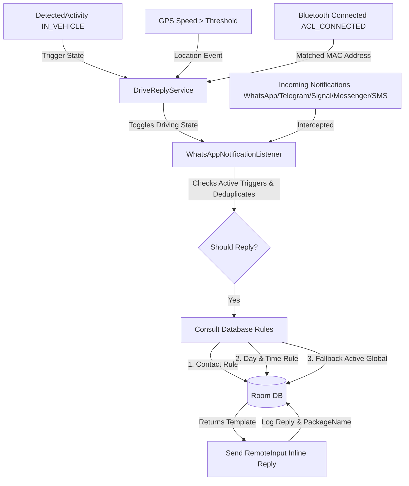

# DriveReply 🚗💬

DriveReply is a premium, high-performance Android companion application designed to automatically detect when you are driving and reply to incoming messages on your behalf using dynamic, highly customizable reply templates.

Built using **Kotlin**, **Jetpack Compose (Material 3)**, **Room Database**, **Google Play Services Location & Activity Recognition**, and **DataStore Preferences**, the app prioritizes driver safety, battery longevity, and strict local privacy.

---

## Key Features

### 🚘 Intelligent Active Triggers
- **Sensor Activity Transition**: Uses the Google Play Services Transition API to seamlessly enter driving mode when physical sensors detect a vehicle entry/exit.
- **GPS Speed Activation**: Automatically launches driving protection when your speed exceeds a configurable threshold (e.g., 15 km/h, 25 km/h) using low-power background location polling.
- **Car Bluetooth Automation**: Automatically toggles driving protection on or off upon connecting to selected "Car Bluetooth" paired devices.
- **Vehicular Exit Debounce**: Employs a 2-minute delay before exiting the driving state. This keeps the auto-reply active during brief stops (e.g., stoplights, fuel stops) and avoids battery-draining state toggles.

### 💬 Platform & Multi-App Support
- **Multi-App Expansion**: Auto-replies are platform-agnostic and support **WhatsApp**, **WhatsApp Business**, **Telegram**, **Signal**, **Facebook Messenger**, and common Android SMS apps (Google/Samsung/AOSP Messages packages).
- **Silent Auto-Replies**: Intercepts incoming notifications using a `NotificationListenerService` and dispatches immediate replies back using Android's native `RemoteInput` framework.
- **Privacy-First Deduplication**: Sends exactly one auto-reply per conversation per driving session (keyed by package + conversation identity). Ignores group chat notifications by default (customizable in Settings).

### 🛠 Reliability & Diagnostics
- **Listener Recovery**: If notification access is granted but the listener is not bound, DriveReply automatically requests rebind and exposes a manual **Rebind Listener** action in Home.
- **Manual Simulation Override**: Developer simulation mode is a hard override; auto triggers cannot force-stop it until you manually turn it off.
- **In-App Debug Logs**: Built-in debug log viewer in Settings with enable/disable toggle, clear, and copy-to-clipboard flow for fast support triage.
- **GitHub Release Updates**: Settings includes update check against GitHub Releases and provides a direct APK download/open-release link when a newer version is available.

### 🎯 Deep Customization Rules
- **Granular Custom Rules**: Define contact-specific message templates, active days of the week, and start/end time windows.
- **Dynamic Matching Engine**: Prioritizes contact-specific rules, then schedule rules, before falling back to the active global template.

### 📊 Safety Analytics Dashboard
- **Circular Safety Score**: A beautiful, hardware-accelerated gauge illustrating your safe driving score based on blocked phone distractions.
- **Spline Protection Chart**: A smooth cubic-bezier line chart drawn using Jetpack Compose `Canvas` showing auto-replies sent over the last 7 days, complete with visual gridlines and alpha-gradients.
- **Donut App Breakdown**: Segment-based circular donut graph with rounded end-caps and responsive legends showing auto-reply ratios across messaging apps.

---

## Architectural Workflow

The following diagram describes how DriveReply orchestrates transition receivers, active triggers, notification listener interceptors, and database queries:



---

## Permissions Guide

To function reliably in the background, DriveReply utilizes:

1. **Activity Recognition** (`android.permission.ACTIVITY_RECOGNITION`)
   - Allows detecting vehicle entry and exit states via physical device sensors.
2. **Notification Listener Access** (`NotificationListenerService`)
   - A system-level permission that allows DriveReply to inspect notification bundles and execute quick-reply actions.
3. **Location (Fine & Background)** (`ACCESS_FINE_LOCATION`, `ACCESS_BACKGROUND_LOCATION`)
   - Required to perform low-power speed-based background service activation.
4. **Bluetooth Connection** (`BLUETOOTH_CONNECT` for Android 12+)
   - Used to fetch and track paired "Car Bluetooth" MAC addresses.
5. **Notification Post Access** (`android.permission.POST_NOTIFICATIONS` for Android 13+)
   - Standard permission to show the persistent foreground service monitoring indicator.
6. **Battery Optimization Exemption** (`ACTION_REQUEST_IGNORE_BATTERY_OPTIMIZATIONS`)
   - Exempts the background service from aggressive Android Doze limits to guarantee real-time replies.
7. **Internet Access** (`android.permission.INTERNET`)
   - Used to check the latest GitHub release and present APK update links.

---

## Getting Started

### Requirements
- Android SDK **API level 29 (Android 10)** or higher.
- Google Play Services enabled on the device.

### Installation
1. Clone the repository:
   ```bash
   git clone https://github.com/richiesamlie/DriveReply.git
   ```
2. Open the directory `DriveReply` in **Android Studio**.
3. Sync Gradle and build the project.
4. Deploy the debug build to your physical device or a Play Services-supported emulator.

### Release Versioning
- CI release tags are published as `v1.0.<run_number>`.
- Release APK metadata is aligned to that same value (`versionName = 1.0.<run_number>`, `versionCode = <run_number>`).
- In Settings → About, DriveReply displays the installed GitHub-style version and can compare it against the latest GitHub release.

---

## Future Enhancements 🚀

- 🧠 **Context-Aware Local AI Auto-Replies (Pending)**: Incorporate lightweight, privacy-focused on-device models to draft custom contextual replies to complex incoming messages.
- 📱 **Quick Settings Tile**: Add a quick settings tile for fast manual overrides to force-activate or force-disable driving monitoring.
- 🗺️ **Execution Roadmap**: See the phased delivery plan in **[docs/ROADMAP.md](docs/ROADMAP.md)**.

---

## Extensive Documentation

For developer-focused architectural deep dives, database schemas, service binding lifecycles, and troubleshooting guides, please check:
👉 **[Developer & Architecture Documentation](docs/ARCHITECTURE.md)**

For execution tracking and completed roadmap milestones, see:
👉 **[Progress Log](docs/PROGRESS.md)**

## License

This project is licensed under the Apache License 2.0.
