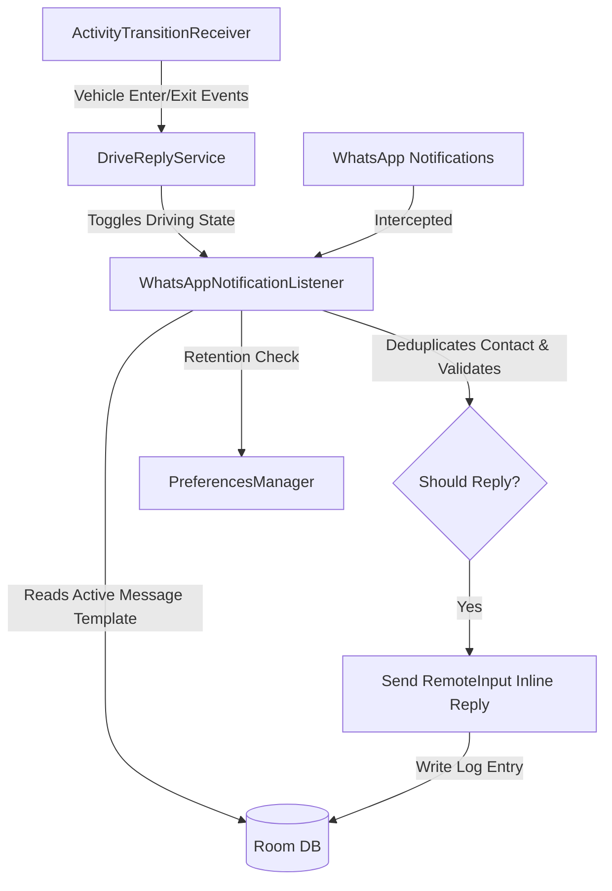

# DriveReply 🚗💬

DriveReply is a premium, high-performance Android companion application designed to automatically detect when you are driving and reply to incoming WhatsApp and WhatsApp Business messages on your behalf using fully customizable reply templates.

Built using **Kotlin**, **Jetpack Compose**, **Room Database**, and the **Google Play Services Activity Recognition Transition API**, the app prioritizes driver safety, battery longevity, and user privacy.

---

## Key Features

- 🚘 **Automatic Driving Detection**: Uses the Google Play Services Transition API to seamlessly enter driving mode when a vehicle transition is detected.
- ⏱️ **Vehicular Exit Debounce**: Employs a 2-minute delay before exiting driving state. This keeps the auto-reply active during brief pauses (e.g., stoplights, fuel stops) and avoids battery-draining state toggles.
- 💬 **Silent Auto-Replies**: Intercepts notifications from WhatsApp (`com.whatsapp`) and WhatsApp Business (`com.whatsapp.w4b`) using a `NotificationListenerService` and replies instantly via Android's native `RemoteInput` mechanism.
- 🔒 **Privacy First**:
  - **Individual Chats Only**: Ignores group chat notifications by default to prevent spamming group channels (customizable in Settings).
  - **Deduplicated Replies**: Sends exactly one auto-reply per unique contact per driving session.
- 📝 **Dynamic Template Manager**: Create, edit, and delete custom reply templates. Tap any template to mark it active.
- 📱 **Premium UI/UX (Material 3)**:
  - Vibrant **Teal & Cyan** themes matching vehicular dashboard styling.
  - Pulsing **Amber/Green/Gray** status cards visually indicating monitoring and active driving modes.
  - Live chat-bubble preview when editing templates.
- 📊 **Sent Reply Logs**: Full history log containing sent messages, target contacts, and relative timestamps ("2 min ago", "Yesterday"). Includes configurable log retention cleanups (e.g., auto-delete older than 7 days).

---

## Architectural Workflow

The following diagram describes how DriveReply handles transitions, notification catches, and safe database verification:



---

## Permissions Guide

To function reliably in the background, DriveReply requires four core permissions:

1. **Activity Recognition** (`android.permission.ACTIVITY_RECOGNITION`)
   - Allows the app to detect vehicle entry and exit states via physical sensors.
2. **Notification Listener Access** (`NotificationListenerService`)
   - A system-level permission that allows DriveReply to inspect incoming notification payloads and execute quick-reply actions. (Requires manual system settings toggle).
3. **Notification Post Access** (`android.permission.POST_NOTIFICATIONS`)
   - Standard Android 13+ permission to show the persistent foreground service monitoring notification.
4. **Battery Optimization Exemption** (`ACTION_REQUEST_IGNORE_BATTERY_OPTIMIZATIONS`)
   - Exempts the background service from aggressive Android Doze limits to guarantee real-time replies.

---

## Getting Started

### Requirements
- Android SDK **API level 29 (Android 10)** or higher.
- Google Play Services enabled on the device.

### Installation
1. Clone the repository:
   ```bash
   git clone https://github.com/richiesamlie/DriveReply.git
   ```
2. Open the directory `DriveReply` in **Android Studio**.
3. Sync Gradle and build the project.
4. Deploy the debug build to your physical device or a Play Services-supported emulator.

---

## Extensive Documentation

For developer-focused architectural deep dives, database schemas, service binding lifecycles, and troubleshooting guides, please check:
👉 **[Developer & Architecture Documentation](docs/ARCHITECTURE.md)**

## License

This project is licensed under the Apache License 2.0.
