# DriveReply — Architecture & Developer Documentation

This document provides a comprehensive technical overview of the **DriveReply** architecture, detailing the background execution lifecycles, database schemas, and permission management structures.

---

## 1. System Architecture Diagram

Below is the complete background pipeline, showing the interaction between the Android OS sensors, the foreground monitoring service, and the notification interception engine:

```mermaid
sequenceDiagram
    autonumber
    participant Sensor as Android Activity Recognition
    participant Recv as ActivityTransitionReceiver
    participant Service as DriveReplyService
    participant listener as WhatsAppNotificationListener
    participant DB as AppDatabase (Room)

    Sensor->>Recv: Broadcast: ENTER IN_VEHICLE
    Recv->>Service: Set DrivingState = True, Clear Session RepliedContacts
    Service->>Service: Update Persistent Notification ("Driving mode active 🚗")
    Note over listener: Listens for WhatsApp notifications while DrivingState is True
    
    rect rgb(30, 40, 50)
        Note right of listener: Notification Received
        listener->>listener: Filter package (com.whatsapp / com.whatsapp.w4b)
        listener->>listener: Verify NOT group chat (unless override setting active)
        listener->>listener: Check if Sender already replied in this session
        listener->>DB: Fetch Active Message Template
        DB-->>listener: Returns active Template body
        listener->>listener: Locate RemoteInput in Notification Actions
        listener->>listener: Send Inline Reply via RemoteInput action PendingIntent
        listener->>listener: Add Sender to repliedContacts Set
        listener->>DB: Log sent reply (ReplyLogEntry)
    end

    Sensor->>Recv: Broadcast: EXIT IN_VEHICLE
    Note over Recv: Start 2-Minute Debounce Timer
    alt Debounce timer expires without vehicular ENTER re-trigger
        Recv->>Service: Set DrivingState = False
        Service->>Service: Update Notification ("Monitoring for driving...")
    else Vehicular ENTER re-trigger occurs before 2 minutes
        Note over Recv: Cancel Debounce Timer, remain Driving
    end
```



---

## 2. Core Service Components & Mechanics

### A. Foreground Service (`DriveReplyService.kt`)
To survive aggressive system memory reclaim, the monitoring is bound to a foreground service utilizing the modern `specialUse` foreground type (mandated on API 34+ for general coordination services).
- **Service Channel**: ID: `drive_reply_service`, Name: "DriveReply Monitor". Low importance to prevent sound/vibration alerts upon starting.
- **State Registry**: Stores a global companion `StateFlow<Boolean>` representing the driving state, and a synchronized `MutableSet<String>` of unique contact titles replied to during the current driving session.

### B. Notification Listener (`WhatsAppNotificationListener.kt`)
Extends `NotificationListenerService` to capture status bar notification updates.
- **Intercept Flow**:
  1. Catches `StatusBarNotification` where `packageName` is `com.whatsapp` or `com.whatsapp.w4b`.
  2. Extracts the `extras` bundle. Pulls out sender text (`Notification.EXTRA_TITLE`).
  3. Inspects `Notification.EXTRA_IS_GROUP_CONVERSATION` to drop group updates unless explicitly allowed by the preferences flow.
  4. Scans notification `actions` array to find an action containing a `RemoteInput` with an editable result key (typically `"key_text_reply"`).
  5. Resolves the active template from the local DB.
  6. Compiles a response bundle:
     ```kotlin
     val results = Bundle().apply {
         putCharSequence(remoteInput.resultKey, templateBody)
     }
     val intent = Intent().apply {
         RemoteInput.addResultsToIntent(arrayOf(remoteInput), this, results)
     }
     action.actionIntent.send(context, 0, intent)
     ```
  7. Inserts a new record into `ReplyLogEntry` and appends the sender's title to the service's `repliedContacts` set to avoid duplicates.

### C. Debounced Exit Transitions (`ActivityTransitionReceiver.kt`)
Driving transitions can bounce (e.g., when stopped at a red light, running into a store quickly, or moving in heavy traffic). To mitigate rapid start/stop toggling:
- An **EXIT IN_VEHICLE** transition initiates a 120,000ms delay via a Handler thread.
- If an **ENTER IN_VEHICLE** event is captured during this window, the pending exit runnable is immediately cancelled, maintaining continuous driving state integrity.

---

## 3. Database Architecture (Room DB)

### Entity: `message_templates`
Stores reply message presets defined by the user.

| Column | Type | Constraints | Description |
| :--- | :--- | :--- | :--- |
| `id` | `TEXT` | `PRIMARY KEY` | Unique UUID string |
| `name` | `TEXT` | `NOT NULL` | Template name (e.g., "Driving") |
| `body` | `TEXT` | `NOT NULL` | Template message content |
| `isActive` | `INTEGER` | `NOT NULL` | Active toggle (0 for false, 1 for true) |
| `createdAt` | `INTEGER` | `NOT NULL` | Unix timestamp of creation |

### Entity: `reply_log`
Chronological history of replies executed by the application.

| Column | Type | Constraints | Description |
| :--- | :--- | :--- | :--- |
| `id` | `TEXT` | `PRIMARY KEY` | Unique UUID string |
| `contactName` | `TEXT` | `NOT NULL` | WhatsApp name/number of recipient |
| `templateName` | `TEXT` | `NOT NULL` | Name of template used for reply |
| `messageSent` | `TEXT` | `NOT NULL` | Message body delivered to the recipient |
| `timestamp` | `INTEGER` | `NOT NULL` | Unix timestamp of execution |

---

## 4. Key Configurations & Battery Mitigations

### A. OEM "Doze" Whitelist
Modern Android overlays (e.g., Samsung OneUI, Xiaomi MIUI) employ highly aggressive background app killing mechanisms.
- DriveReply guides the user to exclude the app from system battery optimization by firing `Settings.ACTION_REQUEST_IGNORE_BATTERY_OPTIMIZATIONS`.
- Provides an link-card on the settings panel directing users to [DontKillMyApp](https://dontkillmyapp.com) for device-specific background locking instructions.

### B. Auto-Listener Rebinding
In rare cases, the Android system may disconnect the custom `NotificationListenerService` due to memory constraints or system updates. To maintain background reliability, `WhatsAppNotificationListener` overrides `onListenerDisconnected()`:
```kotlin
override fun onListenerDisconnected() {
    super.onListenerDisconnected()
    requestRebind(ComponentName(this, WhatsAppNotificationListener::class.java))
}
```
This forces the OS to re-bind the listener immediately upon recovery.
