# DriveReply — Architecture & Developer Documentation

This document provides a comprehensive technical overview of the **DriveReply** architecture, detailing the background execution lifecycles, database schemas, permission models, and custom visual rendering engines.

---

## 1. System Architecture Diagram

Below is the complete background pipeline, showing the interaction between the Android OS triggers, the foreground monitoring service, and the dynamic notification listener engine:

```mermaid
sequenceDiagram
    autonumber
    participant Sensors as Android OS (GPS / Bluetooth / Transitions)
    participant Recv as Receivers (ActivityTransition / Bluetooth)
    participant Service as DriveReplyService (Foreground)
    participant listener as WhatsAppNotificationListener
    participant DB as AppDatabase (Room)

    Note over Sensors, Recv: Trigger Source 1: Activity Recognition IN_VEHICLE
    Sensors->>Recv: Broadcast: ENTER IN_VEHICLE
    Recv->>Service: Set DrivingState = True, Clear Session Contacts

    Note over Sensors, Service: Trigger Source 2: GPS Speed > Threshold
    Sensors->>Service: LocationCallback: Speed > Threshold (e.g. 20 km/h)
    Service->>Service: Set DrivingState = True, Clear Session Contacts

    Note over Sensors, Recv: Trigger Source 3: Bluetooth Car Connection
    Sensors->>Recv: Broadcast: BluetoothDevice ACL_CONNECTED
    Recv->>Service: Matches paired MAC -> Start Service & Set DrivingState = True

    Service->>Service: Update Persistent Notification ("Driving mode active 🚗")
    
    rect rgb(30, 40, 50)
        Note right of listener: Notification Received (Any Supported App)
        listener->>listener: Intercept: WhatsApp, Telegram, Signal, Messenger, and SMS apps
        listener->>listener: Verify NOT group chat (unless override setting active)
        listener->>listener: Check if Conversation already replied in this session
        listener->>DB: Query custom template rules for Sender
        DB-->>listener: Returns matched rules list
        listener->>listener: Match rules against Current Day & Time bounds
        alt Rule Matched
            listener->>DB: Fetch rule's Template
        else No Rule Matched
            listener->>DB: Fetch active global Template
        end
        DB-->>listener: Returns target Template body
        listener->>listener: Locate RemoteInput in Notification Actions
        listener->>listener: Send Inline Reply via RemoteInput action PendingIntent
        listener->>listener: Add Sender to repliedContacts Set
        listener->>DB: Log sent reply (includes target packageName)
    end

    Sensors->>Recv: Broadcast: EXIT IN_VEHICLE
    Note over Recv: Start 2-Minute Debounce Timer
    alt Debounce timer expires without vehicular ENTER re-trigger
        Recv->>Service: Set DrivingState = False
        Service->>Service: Update Notification ("Monitoring for driving...")
    else Vehicular ENTER re-trigger occurs before 2 minutes
        Note over Recv: Cancel Debounce Timer, remain Driving
    end
```



---

## 2. Core Service Components & Mechanics

### A. Foreground Service (`DriveReplyService.kt`)
To survive aggressive system memory reclaim, the monitoring is bound to a foreground service utilizing the modern `specialUse` foreground type (mandated on Android 14+ for general coordination services).
- **Foreground States**: Exposes a global companion `StateFlow<Boolean>` representing active driving state, plus a synchronized `MutableSet<String>` used for per-session deduplication keys.
- **Manual Simulation Override**: Uses explicit state source (`AUTOMATIC` vs `MANUAL_SIMULATION`) to prevent automatic stop triggers from disabling manual simulation mode.
- **GPS Speed Polling**: Employs `FusedLocationProviderClient` with low-power interval updates. Calculates real-time speed and transitions the app into driving mode if the calculated speed exceeds the user-configured speed threshold.

### B. Bluetooth Pairing Trigger (`BluetoothReceiver.kt`)
Listens to `BluetoothDevice.ACTION_ACL_CONNECTED` and `BluetoothDevice.ACTION_ACL_DISCONNECTED`.
- **Match Mechanism**: Compares the connecting MAC address against a `StringSet` in `PreferencesManager` representing the user's selected "Car Bluetooth" devices.
- **Trigger Actions**: Starts and forces `DriveReplyService` into the driving state upon match, and shuts down safely upon disconnection.

### C. Generalized Notification Listener (`WhatsAppNotificationListener.kt`)
Extends `NotificationListenerService` to capture status bar notification updates across multiple communication platforms.
- **Supported Packages**:
  - WhatsApp (`com.whatsapp`) & WhatsApp Business (`com.whatsapp.w4b`)
  - Telegram (`org.telegram.messenger`)
  - Signal (`org.thoughtcrime.securesms`)
  - Facebook Messenger (`com.facebook.orca`)
  - Google Messages (`com.google.android.apps.messaging`)
  - Samsung Messages (`com.samsung.android.messaging`)
  - AOSP Messages (`com.android.messaging`)
- **Platform-Agnostic Extraction**: Scans the notification `actions` array generically to locate `RemoteInput` with an editable result key, bypassing platform-specific structures to execute replies silently via:
  ```kotlin
  val results = Bundle().apply {
      putCharSequence(remoteInput.resultKey, templateBody)
  }
  val intent = Intent().apply {
      RemoteInput.addResultsToIntent(arrayOf(remoteInput), this, results)
  }
  action.actionIntent.send(context, 0, intent)
  ```
- **Conversation-Level Deduplication**: Dedupes by conversation identity (`package + tag` fallbacking to contact key) instead of raw contact text only.
- **Self-Message Guard**: Ignores incoming notifications resolved as the account’s own display name.
- **Listener Health Signals**: Exposes listener connectivity state and logs lifecycle transitions (`created`, `connected`, `disconnected`, `destroyed`) for diagnostics.

### D. Dynamic Template Rule Matching
When a message is received, `WhatsAppNotificationListener` consults `TemplateRuleDao` with the sender's contact name:
1. Fetches all rules matching `contactName` or general catch-all rules.
2. Checks day-of-week active rules (`1` = Monday to `7` = Sunday).
3. Evaluates time window bounds (compares local milliseconds-since-midnight against `startTime` and `endTime` windows).
4. Prioritizes specific contact rules over catch-all workday schedules.
5. If no rules match, falls back to the active global template.

---

## 3. Database Architecture (Room DB)

### Entity: `message_templates`
Stores reply message presets defined by the user.

| Column | Type | Constraints | Description |
| :--- | :--- | :--- | :--- |
| `id` | `TEXT` | `PRIMARY KEY` | Unique UUID string |
| `name` | `TEXT` | `NOT NULL` | Template name (e.g., "Driving") |
| `body` | `TEXT` | `NOT NULL` | Template message content |
| `isActive` | `INTEGER` | `NOT NULL` | Active toggle (0 for false, 1 for true) |
| `createdAt` | `INTEGER` | `NOT NULL` | Unix timestamp of creation |

### Entity: `reply_log`
Chronological history of replies executed by the application.

| Column | Type | Constraints | Description |
| :--- | :--- | :--- | :--- |
| `id` | `TEXT` | `PRIMARY KEY` | Unique UUID string |
| `contactName` | `TEXT` | `NOT NULL` | Contact name/number of recipient |
| `templateName` | `TEXT` | `NOT NULL` | Name of template used for reply |
| `messageSent` | `TEXT` | `NOT NULL` | Message body delivered to the recipient |
| `packageName` | `TEXT` | `NOT NULL` | Target application package name (e.g., `com.whatsapp`) |
| `timestamp` | `INTEGER` | `NOT NULL` | Unix timestamp of execution |

### Entity: `template_rules`
Defines schedules and contact-specific routing mappings.

| Column | Type | Constraints | Description |
| :--- | :--- | :--- | :--- |
| `id` | `TEXT` | `PRIMARY KEY` | Unique UUID string |
| `templateId` | `TEXT` | `NOT NULL` | Foreign key matching `message_templates.id` |
| `contactName` | `TEXT` | `NULLABLE` | Specific contact match (null acts as catch-all) |
| `daysOfWeek` | `TEXT` | `NULLABLE` | Comma-separated active days (e.g., `"1,2,3,4,5"`) |
| `startTime` | `INTEGER` | `NULLABLE` | Start time window in milliseconds since midnight |
| `endTime` | `INTEGER` | `NULLABLE` | End time window in milliseconds since midnight |

---

## 4. Safety Analytics Custom Canvas Rendering

The Analytics dashboard employs native Jetpack Compose `Canvas` drawing to visualize distracted driving metrics cleanly and efficiently:

### A. Cubic Spline Path Calculation
Rather than drawing rigid straight lines between daily reply data points, the spline chart computes curved cubic Bezier coordinates.
- For each sequential coordinate $P_{idx}(x, y)$ and $P_{idx-1}(x,y)$, it places two symmetric control points:
  $$C_1 = \left( \frac{x_{idx} + x_{idx-1}}{2}, y_{idx-1} \right)$$
  $$C_2 = \left( \frac{x_{idx} + x_{idx-1}}{2}, y_{idx} \right)$$
- The path is drawn smoothly using:
  ```kotlin
  path.cubicTo(c1.x, c1.y, c2.x, c2.y, current.x, current.y)
  ```
- Area under the spline is filled using a fading vertical `Brush.verticalGradient` bounding from primary accent to transparent on the Y axis.

### B. Segmented Donut Arc Calculation
App distributions are rendered as a custom segmented ring using standard polar geometry coordinates.
- Total replies are summed to calculate angular ratios:
  $$\theta_{sweep} = \left( \frac{\text{Count}_{app}}{\text{Total}} \right) \times 360^\circ$$
- Drawn sequentially with a custom `Stroke(width = strokePx, cap = StrokeCap.Round)` styling. The rounded cap guarantees an extremely smooth, premium, modern dashboard visual.

---

## 5. Configurations & Resiliency

### A. Auto-Listener Rebinding
In rare cases, the Android system may disconnect the custom `NotificationListenerService` due to memory pressure or system-level configuration changes. To guarantee maximum reliability, `WhatsAppNotificationListener` overrides `onListenerDisconnected()`:
```kotlin
override fun onListenerDisconnected() {
    super.onListenerDisconnected()
    requestRebind(ComponentName(this, WhatsAppNotificationListener::class.java))
}
```
This forces the OS to re-bind the listener immediately upon memory recovery.

DriveReply also includes additional recovery safeguards:
- Home screen warns when notification access is granted but listener is not connected.
- Home screen exposes a manual **Rebind Listener** action.
- ViewModel can trigger rebind recovery and logs each attempt for traceability.

### B. In-App Debug Logging
DriveReply includes an internal debug log stream (`DebugEventLogger`) to simplify support and field diagnostics:
- Runtime events are appended with timestamps (service state changes, listener events, reply decisions).
- Settings screen exposes:
  - `Enable Debug Logs` toggle
  - log viewer
  - `Copy Logs` and `Clear Logs` actions
- This avoids mandatory ADB/logcat usage for most troubleshooting.

### C. GitHub Release Versioning & Update Checks
DriveReply now aligns application metadata and release tags:
- CI generates release tags as `v1.0.<run_number>`.
- APK metadata is set at build time with:
  - `versionName = 1.0.<run_number>`
  - `versionCode = <run_number>`
- Settings provides update checks against GitHub Releases API (`/releases/latest`) and offers direct APK download links when newer releases exist.
